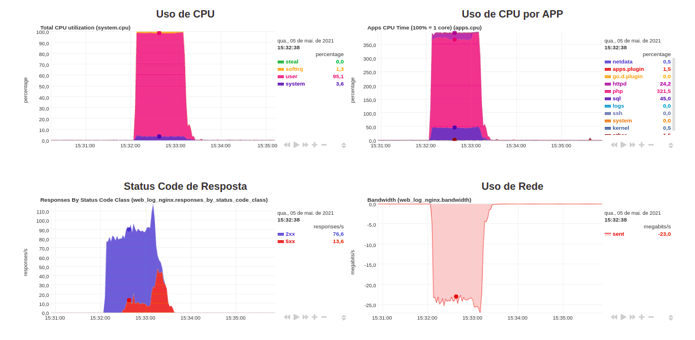
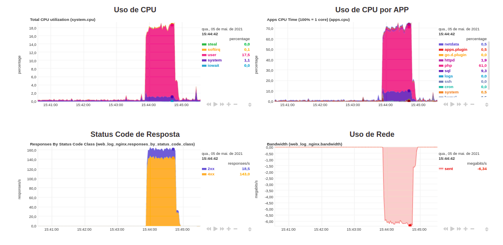
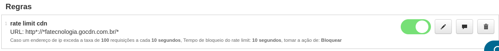
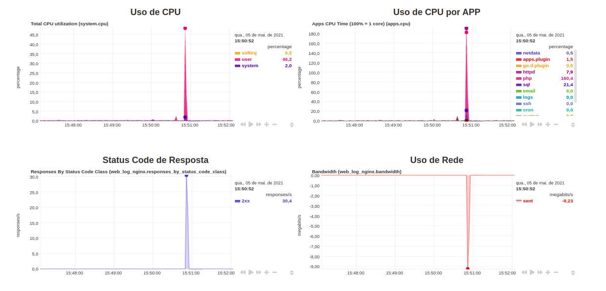
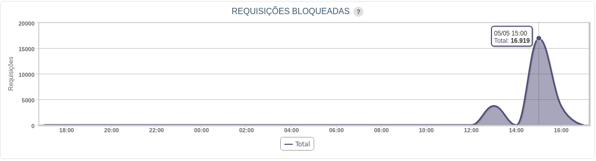
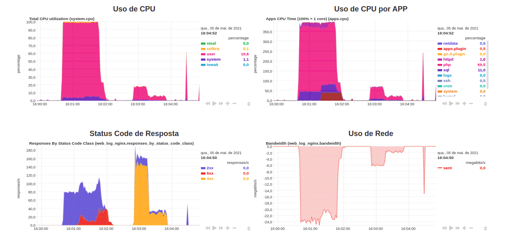

# Laboratório Fatecnologia

Esse repositório visa fornecer os arquivos necessários para a configuração do Laboratório apresentado na Fatecnologia.

O laboratório consiste em preparar uma máquina hospedagem utilizando NGinx, Wordpress e Netdata, que estará sujeita a receber ataques perante a uma máquina atacante que utilizará um script de Flood de HTTP (Simulando um DoS).

Soma-se ao laborátório a presença de uma CDN para intermediar o acesso à hospedagem.

## Requisitos
- **Máquina hospedagem**: possuir com ao menos 2GB de RAM.
- **Máquina atacante**: possuir ao menos 1GB de RAM.
- **Serviço CDN**: acesso à um serviço de CDN que disponibiliza Rate Limit.
- **Domínio**: possuir um domínio para que possa ser feito um apontamento de DNS.

Lembrando que as configurações podem ser adaptadas para os requisitos disponíveis no momento.

## Configuração
Acesse os diretórios referente a cada máquina ou serviço para mais informações de como realizar a configuração.

## Simulações
Para as simulações são apresentados 3 momentos distintos:
- Ataque livre;
- Ataque com Rate Limit aplicado no NGinx;
- Ataque com Rate Limit aplicado na CDN.

### Ataque Livre
Nesse cenário o objetivo é ver o quão impactante é para uma hospedagem receber um ataque direto em sua aplicação sem nenhum tipo de proteção.

Para isso deixaremos o definido como "Modo Default" de configuração do NGinx, para isso basta rodar rodar o script na máquina hospedagem:

```bash
sudo ./nginx-mode.sh default
```

Em sequência recomendamos que deixe aberto tanto os gráficos do NetData, quanto o próprio Wordpress, para que possa ser acompanhado o aumento de uso de recurso e a lentidão no site.

Por fim, basta realizar o ataque na máquina atacante, utilizando o script e informando a quantidade de conexões que serão realizadas por segundo e a duração do ataque (nesse caso estamos rodando o script como Root diretamente):

```bash
./ddos.sh <conexões> <duração>
```

No exemplo em questão estamos solicitando 200 requisições por segundo durante 1 minuto:
```bash
./ddos.sh 200 60
```

Vale desatacar nem sempre será possível de fato estabelecer as 200 requisições por segundo como desejado, visto que pode haver limitações da rede, recursos da máquina ou mesmo da plataforma que está sendo usado para criar as máquinas.

Veja os aumentos dos uso de recurso pelo NetData:


Acompanhe também a lentidão no Wordpress, uma maneira prática de checar isso é realizando uma pesquisa no site.

### Ataque com Rate Limit aplicado no NGinx
Nesse segundo cenário, será aplicado um Rate Limit direto no NGinx. Para fazer essa ativação basta deixar definido como "Modo Rate Limit" nas configurações do NGinx.

Na máquina da hospedagem, é basta executar o seguinte comando:
```bash
sudo ./nginx-mode.sh rate-limit
```

Da mesma maneira como anteriormente, recomendamos que seja deixado os gráficos do NetData e o Wordpress abertos para uma visualização dos impactos que serão causados pelo ataque com a utilização do Rate Limit.

Na máquina atacante será utilizado o script de ataque da seguinte maneira:
```bash
./ddos.sh 200 60
```

Veja quais foram os impactos do segundo ataque:


É possível perceber que houve uma grande diminuição de uso de CPU da hospedagem, e, houve também um aumento do retorno de status 4xx, que basicamente são os status de bloqueios retornados pelo Rate Limit.

### Ataque com Rate Limit aplicado na CDN
No terceiro cenário, será aplicado um Rate Limit na CDN. Considerando que a aplicação se está com o tráfego passando pela CDN e as regras estejam já previamente definidas. Basta realizar a ativação da regra no painel da CDN:


Em sequência realizar o ataque na máquina atacante e acompanhar o uso de recursos por meio do NetData.

O comando utilizado para a realização do ataque foi o mesmo que nos casos anteriores:
```bash
./ddos.sh 200 60
```

Veja quais foram os impactos do terceiro ataque:


É possível ver nesse caso, no painel da CDN as requisições que foram barradas:


### Conclusão
Por fim, é interessante fazer uma comparação geral entre os três momentos, isso é possível realizar utilizando o NetData, basta aplicar um "Zoom out" para englobar o três momentos do ataque:

É perceptível a diferença no uso de recurso da hospedagem, conforme aplicado as medidas de segurança.


Veja que por mais que houve um pico de CPU no último cenário, ele foi momentâneo, visto que os demais acessos foram barrados na CDN, não gerando nenhum processamento por parte da hospedagem perante as requisições que ficaram acima do Rate Limit.